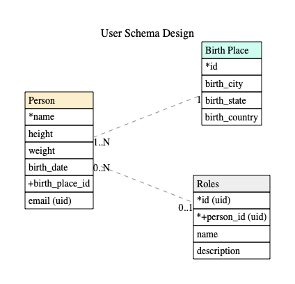

# go-erd

## Usage

```bash
# clone the repository
$ go get github.com/alextanhongpin/go-erd
$ go build
$ ./erd -in in.txt -out out.png
```
## MOTIVATION :muscle:

Create ER (Entity-Relationship) diagrams can be a pain, especially when you need to update them. I find writing the schema as text to be the easiest to maintain, at the same time I would like to see a visual representation of the schema. The endgoal is to create something similar like Markdown, where one can just edit and preview the changes on the go.

This will converts the text below into an Entity Relationship Diagram:

```
# Comments will be skipped :)
# Optionally, we can add titles.
Title: User Schema Design

# Entities.
[Person] {"color": "#fcefce" }
*name
height
weight
birth_date
+birth_place_id
email (uid)

[Birth Place] {"color": "#cefcef" }
*id
birth_city
birth_state
birth_country

[Roles] {"color": "#eeeeee"}
*id
name
description
+person_id

# Relationships.
Person +--1 Birth Place
Person *--? Roles
```

Output:




# Specification

### ENTITY

Entity represents your table. Below is a sample of the `Roles` table:

```
[Roles] {"color": "#eeeeee"}
*id
name
description
*+person_id
```

The name of the Entity must be wrapped in `[]` square brackets, and it may follow an option to configure the table color (NOTE: Only valid CSS color names, e.g. red, green or six character hex code is valid, so `#333` will not be rendered correctly). Any rows after the table name will be attributes (or columns of the table).

Aside from that, there are other operators that we can use to assign to our diagram:
```
* - represents a primary key
+ - represents a foreign key
+* - represents both a foreign and primary key
```

To represent other constraints, such as unique key or types, we can just add it as follow:

```
[Person]
email, text (UID)
```

Simple is best :smile:

### RELATIONSHIP

Each relationship must be between exactly two entities, which need not
be distinct. Each entity in the relationship has exactly one of four
possible cardinalities:

```
Cardinality  Syntax
0 or 1         ?
exactly 1      1
0 or more      *
1 or more      +
```

And we represent them in the format:

```
# A Person has exactly one birth place, but one or more Birth Place may belong to many people.
Person +--1 Birth Place

# A person can have 0 or 1 role, and a role may belong to 0 or many people.
Person *--? Roles
```
